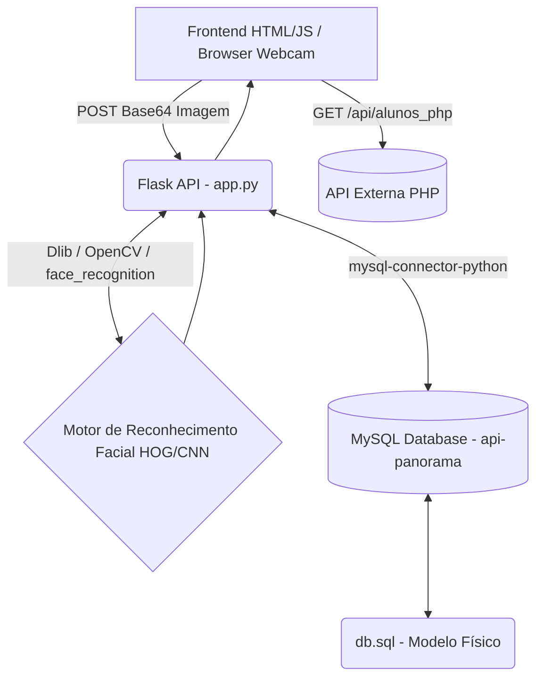
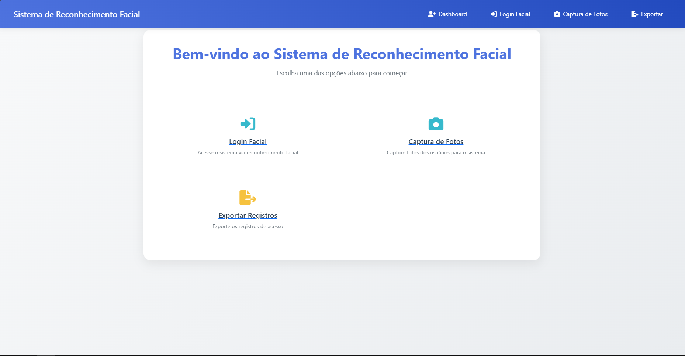
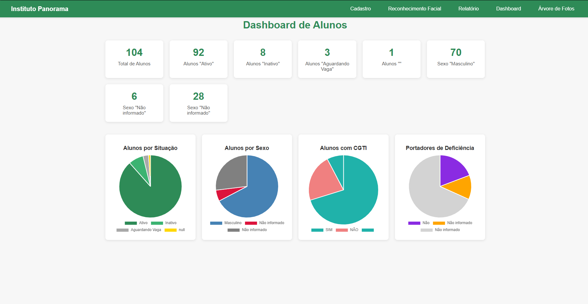
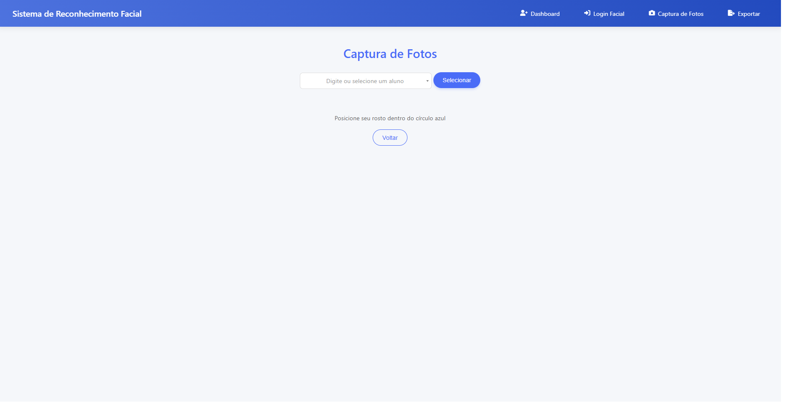
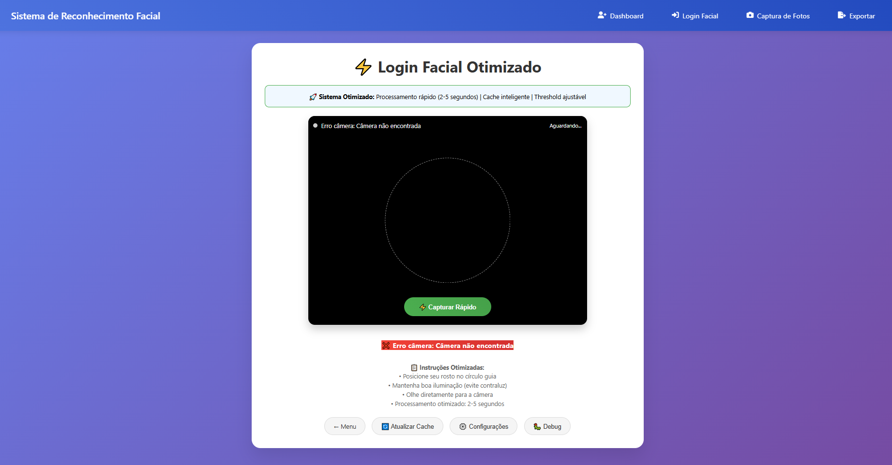
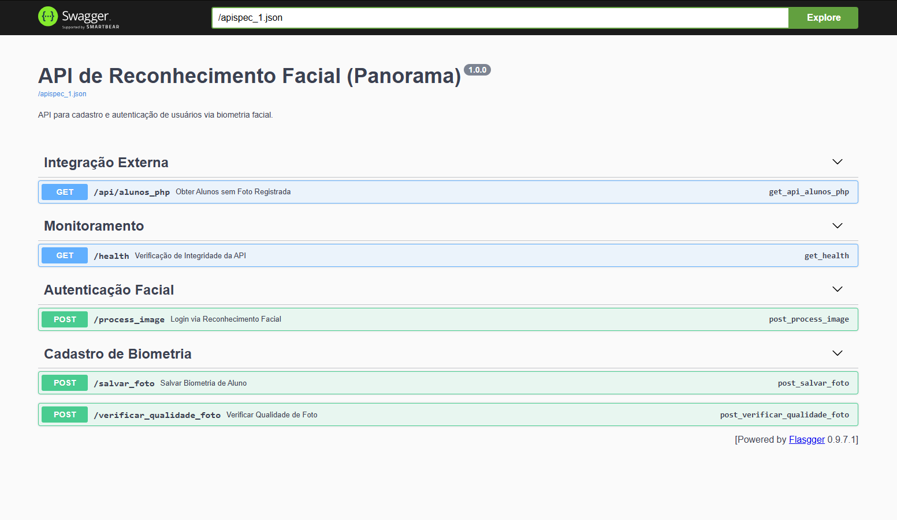

# 📸 Panorama - Sistema de Reconhecimento Facial


## 1. 🎯 Objetivo + Problema

**O problema:** Sistemas tradicionais de login para pontos, escolas e academias, que usam cartões ou senhas, são vulneráveis a fraudes, esquecimentos e demoram no processo de entrada.

**O objetivo:** Este sistema soluciona o problema através da autenticação biométrica facial veloz e segura, funcionando de maneira rápida (mesmo em hardwares e conexões de internet mais lentas). Ele permite **cadastro**, **captura de fotos de alta qualidade** (com fallback de algoritmos robustos a otimizados como HOG/CNN) e um **login real-time** com o rosto do usuário.

---

## 2. 🏗️ Arquitetura

O sistema segue a arquitetura cliente-servidor, sendo o backend responsável pela orquestração do banco e do processamento com inteligência artificial, utilizando a interface do lado do cliente para a captura via webcam/mobile.



---

## 📸 Telas do Sistema (UI) no Navegador

Dê uma olhada na cara do projeto através dessas capturas de tela prontas na pasta `images/`:

### 🏠 Início


### 📊 Dashboard e Acessos


### 👤 Cadastro de Fotos / Captura


### 🔐 Autenticação Facial (Login)


### 🔌 API / Swagger (Documentação)


---

## 3. 🚀 Como Rodar o Projeto

Nossa aplicação está preparada para rodar localmente, em ambiente de produção direto e também orquestrada com o **Docker** e **Docker Compose**.

### Opção A: Utilizando Docker & Docker Compose (Recomendado 🐳)

O uso do Docker configura simultaneamente o Banco de Dados MySQL e o Servidor Web Flask, conectando os containers pela mesma rede e instalando todas as bibliotecas de sistema C/C++ (`cmake`, `dlib`) automaticamente.

1. Instale o [Docker](https://docs.docker.com/get-docker/) e o [Docker Compose](https://docs.docker.com/compose/install/).
2. Na raiz do repositório, rode o comando:
   ```bash
   docker-compose up --build -d
   ```
3. O banco será criado automaticamente usando o script `/database/db.sql`.
4. Acesse o sistema em: http://localhost:8090

> Para derrubar os containers: `docker-compose down`

### Opção B: Rodando Localmente (Development)

1. Crie um banco de dados MySQL chamado `api-panorama` e importe o modelo inicial usando o arquivo `/database/db.sql`.
2. Configure seu ambiente preenchendo as variáveis do arquivo `.env` (banco, senhas, host).
3. Instale o Python (3.9 - 3.11). Recomenda-se inicializar um *virtualenv*:
   ```bash
   python -m venv venv
   source venv/bin/activate  # Linux/Mac
   venv\Scripts\activate     # Windows
   ```
4. Instale as dependências:
   ```bash
   pip install -r requirements.txt
   ```
   *(A biblioteca `dlib` exigirá que o CMake esteja instalado no seu sistema)*
5. Execute o projeto usando Flask ou Gunicorn (Linux):
   ```bash
   flask run --host=0.0.0.0 --port=8090
   # Em produção: gunicorn --bind 0.0.0.0:8090 wsgi:app
   ```

---

## 4. 📝 Exemplos de Request/Response API

Ao lado do frontend nativo, alguns endpoints servem funcionalmente como API:

### `GET /health` (Verificação de Status)

Verifica se a API, Cache e Banco de dados estão saudáveis.

**Response (200 OK - JSON):**
```json
{
  "cache": {
    "cached_users": 15,
    "last_update": "2024-03-12T10:30:00"
  },
  "database": "Connected",
  "status": "OK",
  "users_in_db": 15
}
```

### `POST /process_image` (Login de Face)

Recebe uma foto com a flag de semelhança (threshold) e valida no cache em memória com os rostos dos usuários cadastrados.

**Request JSON:**
```json
{
  "image": "data:image/jpeg;base64,/9j/4AAQSkZJRgABAQE...",
  "threshold": 0.5
}
```

**Response (200 OK - Sucesso - JSON):**
```json
{
  "success": true,
  "name": "Maria Silva",
  "message": "Bem-vindo, Maria Silva!",
  "confidence": 98.2,
  "distance": 0.018,
  "processing_time": 0.45,
  "users_checked": 15
}
```

**Response (400 Bad Request / Rosto não encontrado - JSON):**
```json
{
  "success": false,
  "message": "Nenhum rosto detectado na imagem.",
  "processing_time": 0.12
}
```

---

## 5. 🧪 Qualidade de Código e Testes Python Automatizados

Para garantir a evolução do código mitigando regressão, nós utilizamos o **Pytest** e analisador do ecossistema do Python (**Flake8**).

### Como Rodar os Testes
Com seu ambiente local ativo:
```bash
# Instalar bibliotecas de desenvolvimento e testes
pip install -r requirements-dev.txt

# Rodar os testes no modo verboso (--v)
pytest tests/ -v
```

Nossa suite de testes confere:
- Status de páginas do Frontend (200 OK);
- Comunicação de mock com o banco de dados;
- InteGRIDADE e Resiliência da Integração com o PHP de terceiros.

---

## 6. ⚙️ CI/CD (GitHub Actions)

Toda nova `Pull Request` ou envio (Push) para a branch `main` executa um fluxo de trabalho automatizado (GitHub Actions, `.github/workflows/ci.yml`) que contém as seguintes etapas:

1. **Setup de Ambiente**: Prepara Ubuntu e o Python 3.10.
2. **Dependências do Sistema**: Instala bibliotecas que Cmake e o OpenCV exigem para buildar `dlib` com eficácia;
3. **Lint (`flake8`)**: Valida se há formatações incorretas ou imports ausentes.
4. **Testes (`pytest`)**: Roda os testes unitários parando a pipeline em caso de regressão de qualidade ou endpoint fora do ar.

---

## 7. 🔒 Considerações de Segurança
- Armazenamento de Fotos com Proteção Base;
- O uso da **AI de reconhecimento (HOG/CNN)** verifica variações entre faces. Ela rejeitará fotos distantes dos registros. (Pode ser rigoroso ou frouxo setando `FACE_RECOGNITION_TOLERANCE` via `.env`).
- As senhas do Banco nunca estão versionadas e vêm direto das injeções de contexto do `.env` ou docker-compose variables.
